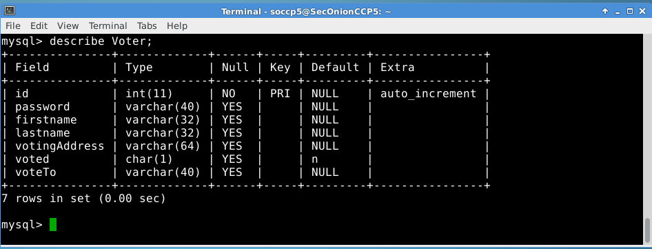
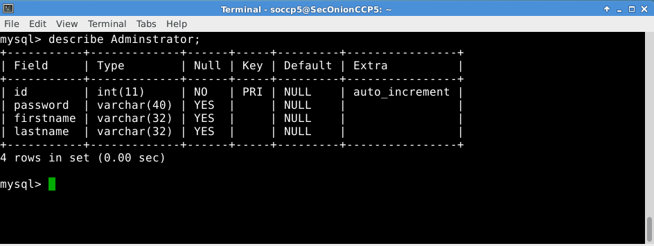
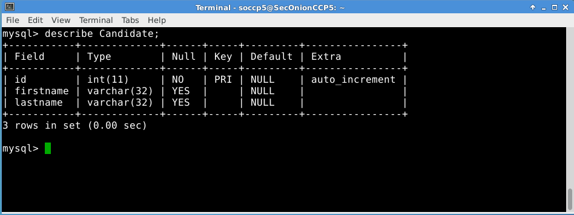

# Database Model

## Description

Task 3.2.1 Create User and Adminstrator model

Three database models:

# Voter
 

# Administrator

# Candidate

> ## Explanation
>
> 1.	Instead of extracting the common fields into a User class, I seperate it into three classes.
 	The reason is because each of them should have an unique id for login purposes in Voting and Main Station.
>
> 2.	Fields like password will be hidden in the database using a function called **sha1('password')** which calculates an 		SHA-1 160-bit checksum. In other words, the password will be encrypted in the database, only the user who knows the 		password can decrypt and validate the password against database when logging in. In order to use this function, the 
	data type must be set to **varchar(40)**.
>
> 3.	The field **votedFor** in Voter will also be encrypted using the same function. However, this field is not finalised 
	because this field should not be recorded and we may place it on blockchain instead in database.
>
> 4.	The field **voted** has a default value of **'n'**, which means when a voter has not voted yet.
>
> 5.	The field **votingAddress** has a default value of NULL, only filled this filed when a voter has voted. This address 
	will be generated from blockchain.
